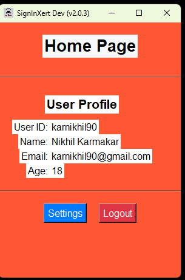
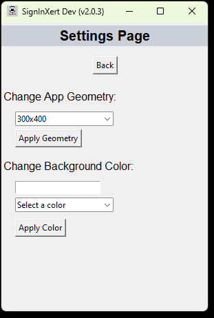
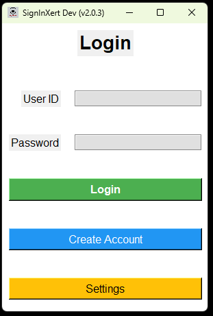
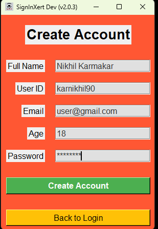
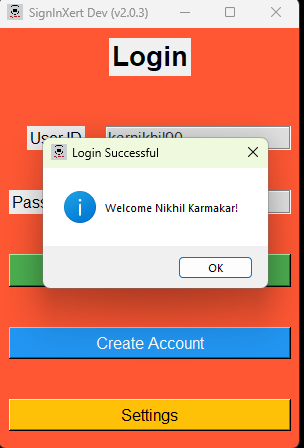
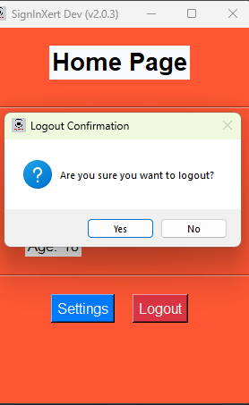

# SignInXert

## Overview

SignInXert is a basic authentication and login system developed to enhance my understanding of Python GUI development using Tkinter. This project represents a significant evolution from my earlier CLI-based versions, reflecting my journey in programming and my passion for creating functional and intuitive applications.

## Project Evolution

Initially, SignInXert was a CLI-based project with several versions aimed at mastering Python basics and logging functionalities. Over time, this project has transitioned into a more sophisticated GUI application, demonstrating advanced concepts and improved user experience. You can explore the earlier versions of this project at [SignInXert CLI Versions](https://github.com/Karnikhil90/MyFirst/tree/main/SignInXert015).

# Screen Short
<p align="center">
  
  
  
  
  
  
</p><br>
<br>

[CLICK HERE FOR MORE ](util/)

## Current Version

The current version of SignInXert is a fully functional GUI application using Tkinter. It incorporates several features for user authentication and data management, including:

- **File Paths & Structure Adjustments:** 
  - The project structure has been organized, and file paths have been adjusted.
  - Brief documentation has been added within the code.

- **JSON Configuration Integration:** 
  - The application now directly reads its configuration from a JSON file using the `FileAccess` module.
  - Default values for all important files have been set to ensure smooth operation.

- **HomePage Enhancements:** 
  - The HomePage UI has been updated to provide a modern look.
  - A working logout feature has been implemented, along with a cache directory that stores the currently logged-in user's data.

- **Settings Management:** 
  - The application includes a Settings page where users can change the window geometry and background color.
  - These settings are saved directly to the `config/*` file.

### Future Implementations

- **Main Application Testing:** 
  - The project is structured for running the main application from `main.py` in the root directory, but further testing and adjustments are needed.

- **New Library Integration:** 
  - A `JsonEditor` library has been added to `src/lib` for modifying the `config_app.json` file, though its full implementation and integration are ongoing.

## File Structure

The project is organized as follows:

```
./ {Root}
    ├── main.py {Works as a driver code. Calls the SignInXert} 
    ├── util/ {INFORMATION for README.md}
    ├── src
    │    ├── SignInXert.py (Main application that runs)
    │    ├── UserDataBank.py
    │    ├── __init__.py {!NOT DEFINED.}
    │    ├── lib/ {Custom modules like JsonEditor, FileAccess, etc.}
    │    ├── icon/ {All icons are stored here}
    │    ├── cache/ {Stores data of the logged-in user}
    │    ├── logs/ 
    │    ├── info/ 
    │    ├── example/ {Test projects, not part of the main application}
    │    ├── database/ 
    │    ├── config/ {Contains config_app.json to modify app settings like background color and geometry}
    ├── LICENSE
    ├── README.md
    ├── .gitignore
```

## UserDataBank Class

The `UserDataBank` class is a crucial component of the application designed to manage user data in JSON format. It provides methods for:

- **Initializing with a File Path:** Loads or creates a JSON file for user data.
- **Reading Data:** Parses and separates user data into different lists.
- **Adding Users:** Adds new user entries to the data file and updates in-memory lists.
- **Searching Users:** Retrieves complete user data by UID.

### Key Features

- Direct access to user data stored in JSON files.
- Automatic creation of new data files if they do not exist.
- Methods for retrieving and updating user data.
- Integration with a custom module (`FileAccess`) for robust file handling.

## Getting Started

1. **Clone the Repository:**
2. **Navigate to the Project Directory:**
3. **Run the Application:**

   ```bash
   git clone https://github.com/Karnikhil90/SignInXert.git
   cd SignInXert
   python main.py
   ```

## License

This project is licensed under the MIT License. See the [LICENSE](LICENSE) file for more details.

## Future Plans

This version is a foundational release, with plans to expand features and enhance the application in future versions. Stay tuned for updates!

## Acknowledgments

- [Tkinter Documentation](https://docs.python.org/3/library/tkinter.html)
- [Python JSON Module](https://docs.python.org/3/library/json.html)
## Update and Plan

For detailed information on the current status and future plans of the project, please refer to the [UPDATE AND PLAN](info/Project_update_plan.md) document.


## About Me

Self-taught coder | Still Learning | Fluent in Java❤️ & Python | C/C++, Rust, & Basic Web Development | Passionate about Embedded Systems ❤️

### Connect with Me

[](https://www.linkedin.com/in/karnikhil90/)
[](https://x.com/karnikhil90)
[](https://linktr.ee/karnikhil90)
